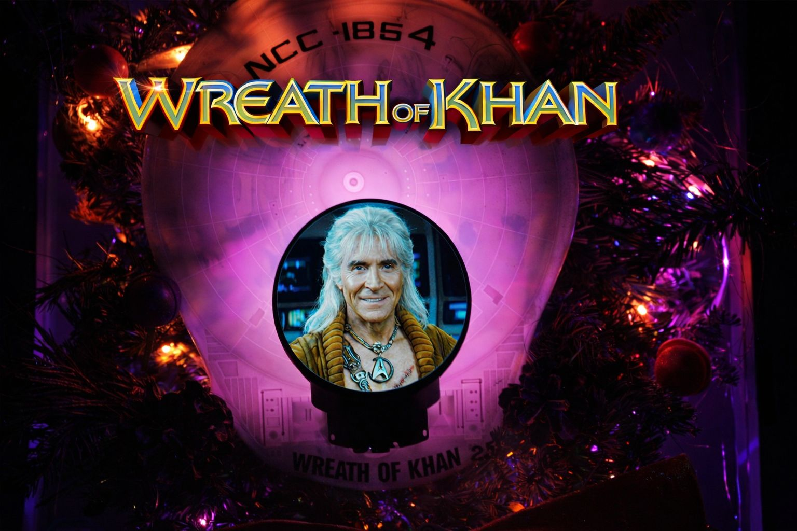

# Wreath of Khan

An electronic wreath project inspired by the iconic Star Trek character.

## Overview

This project creates an electronic wreath display that pays homage to Khan Noonien Singh from Star Trek. 

## Features

- NeoPixel lighting effects (You can either use WLED with one of the Adafruit Sparkle Motion boards or have the Qualia drive pixels)
- 4" 720x720 IPS display for displaying images or animations
- Leave 2025 with great humor and a good looking home decoration

## Setup Instructions

1. **Install CircuitPython**: Follow the [CircuitPython installation guide](https://learn.adafruit.com/welcome-to-circuitpython) to install the latest CircuitPython on your Qualia ESP32-S3
2. **Install Libraries**: Install the `adafruit_qualia` library using the [CircuitPython library bundle instructions](https://learn.adafruit.com/circuitpython-libraries-on-any-computer)
3. **Add Project Files**: 
   - Copy `code.py` to the root directory of your CircuitPython device
   - Copy `khan.bmp` to the root directory of your CircuitPython device

### Required Libraries

- [`adafruit_qualia`](https://github.com/adafruit/Adafruit_CircuitPython_Qualia) - For driving the round RGB display

## Hardware Requirements

### Main Components

- **Microcontroller**: [Adafruit Qualia ESP32-S3 for TTL RGB-666 Displays](https://www.adafruit.com/product/5800) - Dev board with 16MB Flash and 8MB PSRAM designed for driving large RGB displays
- **Display**: [Round RGB TTL TFT Display - 4" 720x720 - No Touchscreen](https://www.adafruit.com/product/5793) - 4" round IPS display with 720x720 resolution and wide viewing angles

### Additional Components

- Pinecones 
- Fresh fir wreath from local tree seller
- Tinsel
- Painted wooden planets
- NCC-1864 USS Reliant DIY model kit
- Hot glue
- Unrelenting vindictiveness towards Captain Kirk

## Demo

Click Thumbnail to Watch

## License

This project is released into the public domain.